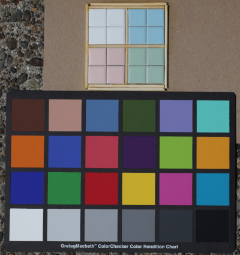

A semi-quantitative look at four pastel-range ceramic tiles from mosaictile dot com, named "Moonstone White Matte MCSQ-11M", "Cherry Blossom Pink MCSQ-1190S", "Glacier Blue MCSQ-1245S" and "Pistachio Green MCSQ-1230S".  I photographed the tiles in direct sunlight alongside a ColorChecker chart and the code here read a raw (.CR2) image to make a comparison with the chart as a calibration reference.

```
tile   CIE L*a*b*              hex     Munsell        ISCC-NBS name
---------------------------------------------------------------------------
white  L*90.3 a*-1.4  b* 1.5   e2e4e0  8.5GY 9.0/1.0  Greenish white
pink   L*80.0 a* 8.6  b* 8.8   ddc0b6  7.2YR 7.9/2.3  Brownish pink
blue   L*73.9 a*-8.1  b*-12.0  98bbcb  2.6B 7.3/3.1   Light greenish blue
green  L*74.2 a*-11.5 b* 7.9   a6bca8  0.5G 7.3/2.8   Light yellowish green
```


